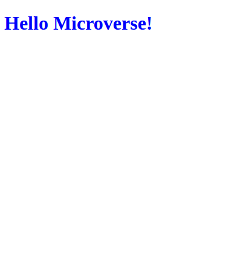

# Project Name: 
Hello Microverse

> In this project we learn about:
-linters
-gitflow and specifically pull requests
-documenting work

The project has a nice, blue "Hello Microverse" greeting.

## Built With

- Major languages: html and css

### Prerequisites: 
none

## Authors: 
Erick Osterling

👤 **Author1**

- GitHub: [@Erick-Osterling](https://github.com/Erick-Osterling)
- Twitter: [@ErickOsterling](https://twitter.com/ErickOsterling)
- LinkedIn: [@Erick Osterling Castillo](https://www.linkedin.com/in/erick-osterling-castillo-49b569104/)

## Show your support

Give a ⭐️ if you like this project!

## Acknowledgments

- Microverse and Coding partners
